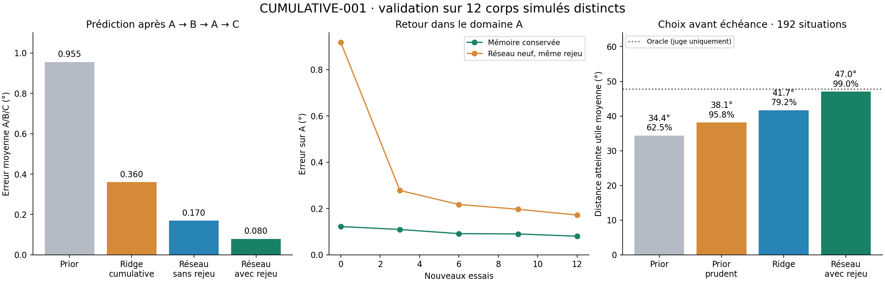

# CUMULATIVE-001 — progrès cumulatif et choix d'action

2026-09-09 · D-054 / D-055 · simulation MuJoCo · calcul neuronal sur RTX 5080.

**Une avancée notable est obtenue : un même apprenant conserve son expérience au
fil de A→B→A→C, reprend exactement après redémarrage et utilise ensuite son modèle
pour choisir des orientations atteignables.** La recette passe sur 12 corps neufs
après six corps de développement. Les poids restent des candidats expérimentaux
persistants ; ils ne sont pas encore raccordés au registre actif de CognitiveKernel.



## Ce qui a changé

Le réseau résiduel 13→64→64→1 apprend sur CUDA, avec un mélange fixe de 50 % de
transitions nouvelles et 50 % de transitions anciennes. Le réseau témoin utilise
la même architecture, les mêmes initialisations et le même nombre de mises à jour,
mais uniquement l'essai courant. Comparateurs supplémentaires : prior nominal,
ridge sur quatre essais récents, ridge sur toute la vie.

Chaque vie conserve son modèle sur quatre phases de 12 essais de 64 pas : A explore
30–90°, B 90–150°, retour à A avec de nouveaux essais, C 30–150°. Le corps reste
constant. Les essais physiques repartent du neutre ; la mémoire de l'apprenant
persiste. Il s'agit d'une succession d'expériences, pas d'une vie physique continue.
Les évaluations sont séparées de l'apprentissage ; le modèle reçoit angle observé,
variation et historique de commande, sans paramètres physiques cachés.

## Validation prédictive : 12 nouvelles vies

Erreur absolue à un pas de 20 ms, moyenne égale A/B/C après la dernière phase C,
puis moyenne égale des 12 vies (quatre par régime physique).

| Méthode | Erreur moyenne |
|---|---:|
| Prior nominal | 0,955423° |
| Ridge, quatre essais récents | 0,416966° |
| Ridge cumulative | 0,360182° |
| Réseau sans rejeu | 0,169863° |
| **Réseau avec rejeu** | **0,079515°** |

Le rejeu réduit l'erreur de **53,19 %** face au réseau naïf, avec avantage dans
12/12 vies. Différence appariée moyenne : 0,090348° ; intervalle BCa descriptif à
95 % [0,074236° ; 0,105484°]. Face à la ridge cumulative : **77,92 %** de réduction,
12/12 vies favorables ; différence 0,280667° [0,237580° ; 0,337495°].
Ce sont les comparaisons internes à ce cycle, pas une comparaison directe aux
0,435° de BODY-SCHEMA-002, dont les données et le protocole diffèrent.

Acquisition et rétention passent les seuils figés sur chaque vie. Au retour A,
l'erreur moyenne des cinq checkpoints vaut 0,098982° avec mémoire contre 0,356328°
pour un réseau neuf avec rejeu recevant les mêmes nouveaux essais. La moyenne des
réductions relatives calculées **par vie** est de **69,93 %**, favorable sur 12/12.
Ce chiffre décrit l'erreur pendant la récupération, pas une réduction mesurée du
temps nécessaire pour atteindre un seuil. Aires trapézoïdales par vie dans le JSON.

Les reprises après B sont exactes dans un nouveau processus pour les deux réseaux
sur les **18 vies** : paramètres, prédictions, puis prochaine mise à jour et RNG.
Les checkpoints sauvegardent également Adam et le buffer. Le test de contrat
contrôle la restitution complète de cet état. Les instances poursuivent réellement
la phase suivante depuis le checkpoint rechargé, sans réentraînement de B.

## Utilité comportementale : choisir avant une échéance

L'épreuve v2 demande de choisir la cible la plus éloignée jugée atteignable avant
une échéance. Utilité : distance angulaire de la cible si elle est atteinte à 2°
près, zéro sinon. Tous les choix sont figés avant que le juge simule les futurs.
L'oracle désigne le meilleur candidat réellement atteignable et reste réservé au juge.
Cette distance est une valeur de test, pas une mesure d'intérêt visuel ou de curiosité.

Développement : 150 situations sur six corps, réseau 97,33 % de réussite ; toutes
les portes passent. Validation distincte : 192 situations sur les 12 autres corps,
départs tous nouveaux, deux échéances nouvelles, aucun apprentissage supplémentaire.

| Choix fondé sur | Réussite | Utilité moyenne | Regret face à l'oracle |
|---|---:|---:|---:|
| Cible la plus proche | 100 % | 5,000° | 42,708° |
| Prior nominal | 62,50 % | 34,375° | 13,333° |
| Prior prudent | 95,83 % | 38,125° | 9,583° |
| Ridge cumulative | 79,17 % | 41,667° | 6,042° |
| **Réseau avec rejeu** | **98,96 % (190/192)** | **47,031°** | **0,677°** |
| Oracle du juge | — | 47,708° | 0° |

Utilité du réseau : **+23,36 %** face au meilleur témoin simple (prior prudent),
**+12,88 %** face à la ridge. Les trois portes figées passent : réussite ≥90 %, gain
≥10 % sur le meilleur témoin simple et regret ≤20 % de l'utilité oracle.
Les 192 situations ne sont pas 192 organismes indépendants : l'unité est le corps.
Les résultats par corps et tous les choix sont conservés dans les données brutes.

## Échecs et limites conservés

- **Contrôle d'orientation v1 négatif.** Suivre une cible imposée produit exactement
  les mêmes trajectoires avec commande directe et les trois planificateurs : erreur
  moyenne 3,345122°, finale 0,025838°. Le planificateur neuronal demande plus de
  variation de commande (87,403° contre 72,778°). Aucune promotion de ce contrôleur.
  V2 pose une autre question et ne transforme pas ce résultat en succès.
- **Oubli important peu présent.** Après B, l'erreur A du réseau naïf augmente en
  moyenne de 0,084963°, au maximum 0,229262° ; seulement 2/12 vies dépassent 0,2°.
  Le rejeu améliore A dans les 12 vies, mais la résistance à un oubli catastrophique
  n'est pas démontrée. La ridge cumulative retient aussi A presque parfaitement.
- **Deux choix neuronaux échouent en validation**, tous sur `speed_dominant/1`
  (14/16 réussites). Le réseau est également un peu trop prudent sur
  `settling_dominant/2` : utilité 50,625° contre 52,5° pour le prior et l'oracle.
  Sa supériorité agrégée n'est pas universelle pour chaque corps ou situation.
- **Attribution limitée.** Le test comportemental ne comprend pas le réseau naïf ;
  son gain ne peut être attribué au seul rejeu. Le contraste prédictif naïf/rejeu,
  lui, est apparié et dispose du même budget de mises à jour.
- **Portée bornée.** Même famille de simulateur, trois régimes physiques, dynamique
  constante au sein d'une vie, commandes connues en apprentissage. Départs neufs
  dans l'épreuve comportementale, mais pas une confirmation générale. Pas encore
  de changement de corps, détection de rupture, perception visuelle ou motivation
  intrinsèque intégrés à ce candidat. Auto-revue Codex, non indépendante.

## Vérification, calcul et fichiers

**336 tests passent en 24,29 s**, dont neuf nouveaux contrats cumulatifs/de choix.
La publication recalcule les utilités, réussites et regrets depuis les futurs
enregistrés, vérifie les agrégations et lie **141 fichiers par SHA-256**. Les sources
gelées correspondent à chaque vie ; le manifeste historique BODY-SCHEMA-002 et la
proposition initiale conservent leurs empreintes. Aucun ajustement sur validation.

Budget durable final du cycle : **496,812 s, soit 8 min 17 s**, calculs, tests et
analyses supervisés inclus, sur 90 min autorisées. Ce compteur somme les durées
des processus ; il n'inclut pas le temps de rédaction. Aucune réservation inachevée.
RTX 5080 réellement utilisée : événements CUDA d'entraînement des deux réseaux
principaux totalisant 137,94 s sur développement + validation. Ces événements
excluent les instances neuves de comparaison, les sondes de reprise et l'inférence.
Le petit réseau alloue au maximum environ 66 MiB selon PyTorch ; cette épreuve
ne mesure pas le débit maximal de la carte. Aucune recherche massive nécessaire.

- [Résultats, détails par vie et empreintes](cumulative_001_results.json)
- [Journal des avancées et échecs](cumulative_001_log.md)
- [Protocole cumulatif](cumulative_001_preregistration.md),
  [validation prédictive](cumulative_001_validation.md)
- [Contrôle v1](cumulative_001_control_v1.md),
  [choix v2](cumulative_001_control_v2.md),
  [validation comportementale](cumulative_001_choice_validation.md)
- [Manifeste de développement](cumulative_001_dev_v1.json),
  [manifeste de validation](cumulative_001_validation_v1.json)
- Données et checkpoints locaux : `data/processed/experiments/cumulative_001/` ;
  `dev/v1/<régime>-<index>/C/` et `validation/v1/<régime>-<index>/C/` contiennent
  les poids finaux. Les essais, prédictions et reprises sont dans les mêmes vies.
  `control/v1`, `control/v2`, `control/validation_v1` conservent chaque épreuve.
  Ces données sont exclues de Git par la règle existante `data/` : conserver ce
  dossier avec le dépôt pour disposer des poids et des preuves brutes.

Pour vérifier et régénérer uniquement le résumé JSON et le graphique depuis les
preuves existantes, sans rejouer les expériences :

```powershell
.\.venv\Scripts\python.exe -m learning.cumulative_001_budget --kind analysis -- -m learning.cumulative_001_publish
```

Cette commande ajouterait son temps au budget ; le chiffre ci-dessus est celui
du bilan D-055. Les banques terminées ne doivent pas être écrasées ou relancées
pour régler un modèle. Une nouvelle recette demande une nouvelle variante.

## Décision et prochaine étape

Le point d'arrêt demandé — des avancées notables et prometteuses avec succès et
échecs consignés — est atteint pour ce cycle. Le candidat neuronal persistant est
retenu comme base expérimentale, et le choix avant échéance comme usage probant.
Le modèle F déjà actif dans CognitiveKernel reste l'acquis précédent.

La prochaine étape ciblée est de relier ce candidat au noyau avec ses preuves de
capacité, puis de tester une rupture de dynamique observable et sa récupération
dans une nouvelle vie continue. Il faudra aussi comparer le réseau sans rejeu
dans l'usage comportemental avant d'y attribuer un rôle causal au rejeu.
