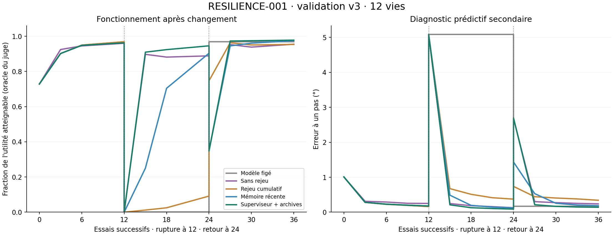

# RESILIENCE-001 — récupérer après une rupture et préserver ses acquis

2026-09-10 · D-056 / D-057 · simulation MuJoCo, apprentissage CUDA sur RTX 5080.

**Le service neuronal est intégré à la mémoire du noyau et la récupération v3 passe
les critères de ce banc sur 12 nouvelles vies. Un corps reste pourtant fragile :
la résilience générale du noyau n'est pas acquise.** Les deux variantes précédentes
et leurs échecs restent conservés. Aucun calcul de ce cycle n'est encore en cours.



## Résultat principal : validation v3 sur 12 nouvelles vies

Recette identique à celle qui passe les six vies de développement, nouveaux corps
et apprenants neufs, sans ajustement après accès. **Les cinq portes préspécifiées
passent** : détection, fausses alarmes, gain fonctionnel sur figé, maintien à moins
de 5 % du meilleur témoin adaptatif et reprise exacte. Le seuil de 5 % est un repère
pratique sur la moyenne, pas une preuve statistique générale de non-infériorité.

Les **24 changements** (12 ralentissements et 12 retours) sont détectés au premier
essai observé, soit 64 pas / 1,28 seconde simulée après la rupture. Aucune fausse
alarme durant l'acquisition initiale. **24 sous-objectifs ouverts puis clos**, selon
le critère prédictif interne, et **12 rappels d'archives** au retour. Les 12 reprises
du service en cours de récupération reproduisent l'état et la prochaine mise à jour.

| Méthode | Utilité pendant la récupération | Réussite pendant la récupération | Réussite après 12 essais |
|---|---:|---:|---:|
| Modèle figé | 0,000° | 0,00 % | 0,00 % |
| Rejeu cumulatif | 0,602° | 4,63 % | 9,72 % |
| Mémoire récente | 11,354° | 62,50 % | 90,97 % |
| Sans rejeu | 16,100° | 90,51 % | 89,58 % |
| **Superviseur + plasticité + archives** | **16,782°** | **93,52 %** | **95,14 %** |

La récupération agrège les checkpoints 3/6/12 : 432 décisions, corrélées au sein de
12 vies. Le dernier checkpoint comporte 144 décisions, dont 137 réussissent pour
le superviseur. Son utilité vaut **+4,24 %** face au meilleur témoin simple (sans
rejeu) et **+47,81 %** face à la mémoire récente. L'avantage sur le naïf est modeste.
Le modèle figé échouant totalement, aucun pourcentage de gain contre zéro n'est calculé.

Au retour de l'ancienne dynamique, utilité moyenne 50,370° contre naïf 49,120°
(+2,54 %) et mémoire récente 49,653° (+1,45 %). Réussite du superviseur 97,22 %,
contre 98,38 % pour le rejeu cumulatif, dont les choix ont une utilité inférieure.
L'aire d'erreur prédictive au retour reste moins bonne que celle de la mémoire
récente (5,840 contre 5,396 degré·essais). Le rappel ne domine donc pas chaque mesure.

### Le cas fragile que la moyenne ne doit pas masquer

`validation/v3/life-04` ralentit de 611,14 à 120,32°/s. Sa réussite après rupture
passe de 0 % à 33,33 %, 41,67 %, puis seulement **50 %** après 12 essais. Son utilité
finale est **5° sur 11,667° atteignables**, malgré une erreur prédictive à un pas
de seulement **0,0815°**. La mémoire récente le dépasse pendant la récupération.

Cela révèle une limite décisive pour le projet : le sous-objectif prédictif peut
être déclaré clos alors que le comportement reste insuffisant. Cette vie n'est
ni exclue ni corrigée après coup. Sa cause précise reste à isoler dans une nouvelle
expérience ; les résultats ne suffisent pas à l'attribuer à un mécanisme particulier.
La prochaine étape doit relier le besoin d'apprentissage et son critère de clôture
au fonctionnement réellement observé, puis au choix des expériences par l'organisme.

## Cadrage appliqué

Le but du projet est un noyau résilient qui apprend dans des situations nouvelles.
La précision motrice sert de diagnostic secondaire. L'adaptation, la réutilisation
d'acquis, la récupération après interruption et, à terme, l'apprentissage intrinsèque
des objectifs et des interactions avec le monde déterminent la direction.
Ce cadrage d'Anthony est inscrit dans l'architecture, le brief, le pilotage et les
décisions. Le corps électromécanique et l'interaction humaine restent l'horizon.

## Ce qui est réellement intégré au noyau

Un service neuronal expérimental utilise maintenant la mémoire SQLite de
`CognitiveKernel`. Chaque expérience lie atomiquement son contenu, le nouveau
checkpoint, le curseur et la décision du superviseur. Le registre contient les
versions candidates et l'état du sous-objectif de récupération. La prédiction
peut être servie depuis le checkpoint du service après réouverture du noyau.

Le checkpoint inclut poids, Adam, RNG, mémoire récente, archives, détecteur,
historique et compteur de plasticité temporaire. Une expérience interrompue est
reprise sans double apprentissage ; un contenu différent sous le même identifiant
est refusé. Les fichiers sont contrôlés par SHA-256. Les candidates expérimentales
ne remplacent pas implicitement les modèles déjà qualifiés d'autres modules.

Le sous-objectif « rétablir la prévisibilité » s'ouvre selon l'erreur observée par
l'agent, puis se clôt après retour à la stabilité. **Sa règle est écrite par le
chercheur** : cela n'établit pas une génération autonome et ouverte d'objectifs.
L'agent ne connaît ni phase du banc, ni vitesse physique, ni résultats futurs du juge.

## Une perturbation qui oblige à s'adapter

Chaque vie dure 36 essais de 64 pas, soit 46,08 secondes simulées. Vitesse initiale
480..720°/s, ralentissement non annoncé à 120..240°/s après 12 essais, puis retour
après 12 autres essais. Gain/amortissement tirés par vie. L'environnement physique
continue sans réinitialisation, avec commandes continues aléatoires entre 30° et 150°.

Les cinq agents reçoivent les mêmes transitions : modèle figé après acquisition,
réseau sans rejeu, rejeu cumulatif, mémoire des quatre essais récents, superviseur
avec archives. Les quatre apprenants adaptatifs ont le même budget de mises à jour.
Le superviseur archive les acquis stables, sélectionne une archive uniquement sur
ses observations récentes et réduit l'influence des anciennes données en récupération.

Les évaluations restent à part : choix d'une cible atteignable avant échéance,
avec observations identiques et décisions fixées avant que le juge calcule les futurs.
Utilité = distance de la cible si elle est atteinte à 2° près, zéro sinon. L'oracle
indique la meilleure utilité atteignable uniquement au juge. Le score principal
agrège les checkpoints 3/6/12 après perturbation puis les vies à poids égal.
Les répétitions de situations ne sont pas des organismes indépendants.

## Variantes et échecs conservés

**V1 : arrêt technique.** Après la première vie, un test supplémentaire révèle qu'un
optimiseur restauré peut partager ses tenseurs avec l'archive. La copie aurait donc
pu altérer sa mémoire. Correction par copie profonde, test reproduisant puis éliminant
le défaut. Les sources et traces v1 sont archivées ; les cinq autres vies n'ont pas
été exécutées. Aucun résultat de cette banque incomplète n'est une validation.

**V2 : récupération, mais coût fonctionnel trop élevé.** Six vies complètes : cinq
ralentissements détectés après deux essais, six retours détectés, aucune fausse alarme
initiale ; onze sous-objectifs ouverts puis clos et six rappels d'archives. Pourtant,
l'utilité après rupture vaut 17,292° contre 19,167° pour le réseau sans rejeu :
**−9,78 %**, au-delà des 5 % tolérés. La validation v2 prévue n'a pas été lancée.
La meilleure erreur finale à un pas n'annule pas cet échec fonctionnel.

Dans cette même v2, rejeu cumulatif : utilité 0,231° et 1,39 % de réussite pendant
la récupération ; modèle figé : zéro. Le mécanisme utile sur un corps stable peut
devenir néfaste lorsque les expériences anciennes décrivent une physique obsolète.
Cette observation est locale au banc ; elle ne condamne pas toute forme de mémoire.

**V3 : variante distincte de plasticité temporaire.** Une forte surprise déclenche
immédiatement la réponse, puis trois essais donnent priorité aux transitions nouvelles.
La mémoire récente reste enregistrée et le rejeu reprend ensuite. Les archives
restent séparées et immuables. Les deux changements sont évalués ensemble ; leur
contribution individuelle n'est pas isolée. Sources et nouvelles graines gelées.

## Portée et limites

L'intégration concerne un service cognitif expérimental ; l'orchestration générale
de la vie, les capteurs multiples, la compréhension du monde et l'interaction humaine
ne sont pas réalisés par cette étape. Les expériences d'apprentissage sont encore
choisies par le banc : le besoin interne de récupération ne constitue pas à lui seul
une politique d'exploration intrinsèque.

Le changement est abrupt, sur une limite de vitesse, puis la physique revient à un
état connu. Le bruit sensoriel, les pertes de capteurs, les ruptures graduelles et les
changements d'environnement visuel ne sont pas testés ici. Les positions de rupture
sont fixes dans le banc, mais ne sont pas transmises aux agents. La fausse alarme
est mesurée sur une acquisition très courte avec huit essais de rodage.

Le service cognitif est redémarré dans un autre processus alors que son simulateur
hôte continue. Cela qualifie la reprise cognitive aux frontières d'essais ; pas le
redémarrage intégral de la machine physique au milieu d'un mouvement. Les vérifications
CUDA sont faites sur cet environnement matériel/logiciel, sans équivalence inter-GPU.
Auto-revue Codex non indépendante. Aucune capacité humaine ou autonomie générale
n'est déduite de ces tests sensorimoteurs bornés.

## Sources de reprise

- [Journal des progrès et échecs](resilience_001_log.md)
- [Protocole initial](resilience_001_preregistration.md), [nouvelle recette v3](resilience_001_v3.md)
- [Résultats v2 complets et empreintes](resilience_001_dev_results.json)
- [Développement v3 et empreintes](resilience_001_dev_v3_results.json)
- [Validation v3, détails par vie et 234 empreintes](resilience_001_validation_v3_results.json)
- [Validation v2 non lancée](resilience_001_validation.md), [protocole de validation v3](resilience_001_validation_v3.md)
- [Preuve des 345 tests](resilience_001_tests_receipt.json)

Données brutes et noyaux : `data/processed/experiments/resilience_001/`, séparés par
banque/variante/vie. Les dossiers `source_v1` et `source_v2` gardent les sources exactes
des variantes antérieures. Ces données sont exclues de Git par la règle existante :
conserver le dossier avec les rapports pour garder checkpoints et preuves brutes.

Le budget durable commun est `budget.sqlite` ; toutes les variantes, les tests et
les essais échoués y restent comptés. Plafond 5400 secondes cumulées, 900 par invocation.

## Vérifications finales et décision

**345 tests passent en 24,95 s.** Les sources correspondent encore au reçu de tests.
L'audit de validation vérifie 234 fichiers, 1728 situations comportementales à tous
les checkpoints, les métriques depuis les futurs enregistrés, les états des 12 noyaux
et l'absence de duplication complète apprentissage/évaluation. Reprise mécanique
continue entre essais contrôlée ; aucune remise à zéro lors d'une rupture.

Budget final D-057 : **1022,517 s, soit 17 min 03 s**, pour 22 invocations supervisées,
tests et variantes échouées inclus ; aucune réservation inachevée. Ce compteur est
celui des processus, hors rédaction. Les seules vies de validation prennent 439,798 s
dans le lanceur. L'entraînement utilise CUDA sur RTX 5080 ; le petit modèle n'est
pas un test de saturation du GPU. Mémoire active bornée à 256 transitions, six
archives maximum ; environ 339 Mo de données/checkpoints locaux pour le cycle.

Incident de préparation documentaire : un enrichissement facultatif du manifeste
a échoué avant écriture. Le manifeste original est resté gelé ; le contrôle
supplémentaire de collision avec les autres variantes a été effectué juste après
lancement (zéro collision), dans un [reçu séparé](resilience_001_validation_v3_provenance.json).
Le protocole de validation existait avant le lancement ; aucune recette n'a changé.

**Décision D-057 : conserver le service et la recette v3 comme base expérimentale
de récupération, avec preuve bornée à ce banc.** Les versions du registre restent
candidates ; leur statut ne devient pas une qualification universelle de résilience.
V1 reste un arrêt technique, v2 un échec fonctionnel, et le cas fragile v3 demeure
une priorité. La suite vise le choix d'expériences selon un besoin interne et une
clôture de récupération fondée sur la capacité réelle, sur de nouveaux cas et avec
perturbations plus variées. Les banques consommées ne servent plus au réglage.

Pour auditer à nouveau les preuves et régénérer la figure sans réentraîner :

```powershell
.\.venv\Scripts\python.exe -m learning.resilience_001_budget --kind analysis -- -m learning.resilience_001_publish --manifest docs/research/resilience_001_validation_v3.json
```

Cette commande ajouterait son temps au ledger ; le budget ci-dessus est le relevé
de clôture D-057. Les expériences terminées ne doivent pas être écrasées.
