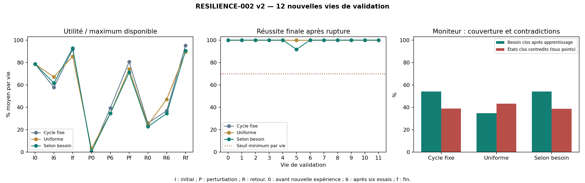

# RESILIENCE-002 — apprendre depuis ses résultats et choisir ses expériences

2026-09-10 · D-058 / D-059 · simulation MuJoCo, apprentissage CUDA sur RTX 5080.

**La récupération fonctionnelle ne passe pas ses critères sur 12 nouveaux corps.
Le choix actif ne passe pas le seuil de gain prévu.
Le moniteur global reste non qualifié.**
La résilience générale et l'autonomie ouverte du noyau ne sont pas acquises.

## Validation sur douze vies neuves

Même recette que les six vies de développement ; nouveaux corps, poids initiaux,
graines et instants de rupture. Trois politiques disposent chacune d'un corps
physique continu, du même budget et du même modèle. Seule la sélection de catégorie
change. Le noyau reçoit ses observations et résultats vécus, sans paramètres cachés,
étiquettes de phase ou récompenses du juge.

| Politique | Réussite finale après rupture | Pire vie | Utilité finale / oracle | Utilité pendant récupération |
|---|---:|---:|---:|---:|
| Cycle fixe | 100.00 % | 100.00 % | 80.56 % | 9.253° |
| Uniforme | 100.00 % | 100.00 % | 74.00 % | 8.333° |
| Selon besoin | 99.31 % | 91.67 % | 71.18 % | 7.847° |

L'utilité récompense la distance atteinte à l'échéance demandée, à 2° près.
La réussite finale comporte 144 décisions, regroupées en 12 vies.
L'utilité pendant récupération moyenne les checkpoints 6 et fin, avec poids égal
par vie. Le gain actif contre le cycle fixe est **-15.20 %**, contre un seuil
prévu de +10 %. La stratégie active fait mieux dans 3 vies,
égalité dans 3, moins bien dans 6 : son effet n'est
pas uniforme. Ces seuils sont des repères expérimentaux, pas une preuve statistique
de généralité. La moyenne des fractions oracle n'est pas un ratio global pondéré.

| Porte confirmatoire | Verdict |
|---|---|
| Récupération : moyenne, pire vie et utilité | Échoue |
| Sélection active : gain ≥10 % contre cycle | Échoue |
| Moniteur global : <10 % de contradictions et couverture ≥50 % | Échoue |

Le corps ayant la plus faible fraction d'utilité finale pour `need`, `life-03`,
atteint 21.43 % de l'oracle et réussit
100.00 % de ses choix. Ce cas reste dans les moyennes.
Le banc diffère de RESILIENCE-001 : aucune supériorité chiffrée entre les deux cycles
n'est déduite de leurs moyennes.

Le gain de développement (+17,77 % sur six vies) ne se reproduit pas : il devient
-15.20 % en validation. Décision : conserver le cycle fixe comme référence
simple pour la suite ; ne pas promouvoir ce sélecteur actif. Le témoin cycle passe
les portes de récupération sur cette validation, mais avait échoué à la porte
d'utilité en développement : il n'est pas déclaré robuste universellement.

## Avancée concrète dans le noyau

`FunctionalStore` persiste ensemble la décision d'expérience, les prévisions et
promesses formulées avant action, les résultats vécus et le checkpoint complet.
Poids, Adam, RNG d'entraînement et de sélection, mémoire, historique et besoin
survivent à la réouverture. Les résultats alimentent 32 exemples par essai, jamais
les futurs contrefactuels du juge. 12 reprises interprocessus
reproduisent l'état, le prochain choix et la prochaine mise à jour sur une branche
non engagée de données déjà vécues. Les corps restent en mémoire ; leurs pas sont
suspendus pendant cette sonde, sans remise à zéro ni preuve de fonctionnement temps réel.

Le choix selon besoin utilise la couverture des catégories et leurs erreurs vécues.
Il est donc lié à l'expérience propre, mais les trois catégories, le score et les
règles de clôture sont écrits. Ce n'est pas encore la découverte autonome de buts,
de concepts corporels ou d'interactions humaines. Le registre garde des candidates
expérimentales ; aucune activation universelle ou changement matériel.

## Échecs et portée du moniteur

La v1 a échoué techniquement après deux commits : un score NumPy ne se rechargeait
pas avec `weights_only=True`. Sources et vie partielle sont conservées. V2 convertit
ce score en `float` natif ; une régression teste quatre décisions et relectures.
Il n'y a eu aucun changement de formule d'apprentissage pour cette correction.

Le code d'analyse gelé compte l'honnêteté après apprentissage :
4/39 checkpoints clos contredits, couverture
54.17 %. Mais le protocole en prose n'excluait pas les
checkpoints immédiatement après rupture. L'audit les réintègre :
**22/57 états clos contredits
(38.60 %)**, dont
18 avant nouvelle expérience et
4 après apprentissage. La porte stricte prévaut.
Le booléen `monitor_pass` de l'analyse restreinte ne vaut pas qualification globale.

Un changement caché ne peut pas être anticipé sans indice ; le résultat montre
précisément que le besoin clos n'est pas une garantie intemporelle. Au retour d'un
corps rapide, un choix trop petit peut réussir tout en gaspillant l'essentiel de
la capacité disponible : réussite, utilité et connaissance de ses limites doivent
rester séparées. Aucun échec n'est effacé par la précision du modèle.

Le cas `validation/v2/life-03` expose un mécanisme concret : après le ralentissement,
la politique active choisit finalement 5° sur 23,333° disponibles, tout en réussissant
ses 12 actions. Sa marge globale atteint 3,515°, donc aucune cible ne satisfait le
seuil de promesse à 2° et toutes les décisions utilisent le repli vers la plus petite.
Une alarme tardive, sur une expérience de grande amplitude alors que la dynamique
n'a pas rechangé, vient de vider le rejeu et les preuves récentes. Le cycle fixe
atteint 16,667°. Cette trace montre un couplage fragile entre sélection, alarme et
marge globale ; elle ne suffit pas à attribuer toute la perte à un seul composant.
Les comptes de catégories sont proches entre politiques : leur total seul
n'explique pas l'effet de l'ordre des expériences et des réinitialisations.

Le détecteur du choix actif déclenche après 1 à
4 essais pour les 24/24 changements
qu'il signale ; un essai représente 128 pas, soit 2,56 secondes simulées.
Il produit aussi 4 alarmes dans les phases initiales sans changement
physique imposé. Ces diagnostics sont descriptifs et n'ajoutent pas de porte
ajustée après accès aux résultats.

## Traçabilité et suite

358 tests passent en 25,32 s ; interruptions après publication, avant commit et
après commit, idempotence, contenu divergent, annonces réécrites, prochaine sélection,
alias de checkpoint et continuité physique sont couverts. Le reçu donne les
versions du runtime et les empreintes des sources. L'audit vérifie
573 expériences du noyau et leur contenu exact,
73344 pas physiques et 36672 updates
pour chacune des trois politiques. 1296 situations tenues à part,
3888 décisions corrélées, 885 fichiers
bruts/checkpoints inventoriés par SHA-256. Les 375 artefacts historiques vérifiés
sont inchangés. Données locales sous `data/processed/experiments/resilience_002`,
exclues de Git : conserver ce dossier.

La suite doit distinguer compétence estimée, preuve récente et besoin d'exploration,
puis évaluer la récupération sur d'autres perturbations et distributions d'expérience.
Un nouveau protocole et de nouvelles banques précéderont toute modification ; ces
vies de validation ne doivent pas devenir un terrain de réglage. Les résultats
permettent de retenir les capacités ayant passé leurs portes, avec leurs limites.

Documents : [journal](resilience_002_log.md), [protocole](resilience_002_preregistration.md),
[validation fixée avant calcul](resilience_002_validation_v2.md),
[résultats détaillés](resilience_002_validation_v2_results.json),
[audit strict](resilience_002_validation_v2_audit.json),
[diagnostics par vie](resilience_002_validation_v2_diagnostics.json),
[tests](resilience_002_tests_receipt.json).
